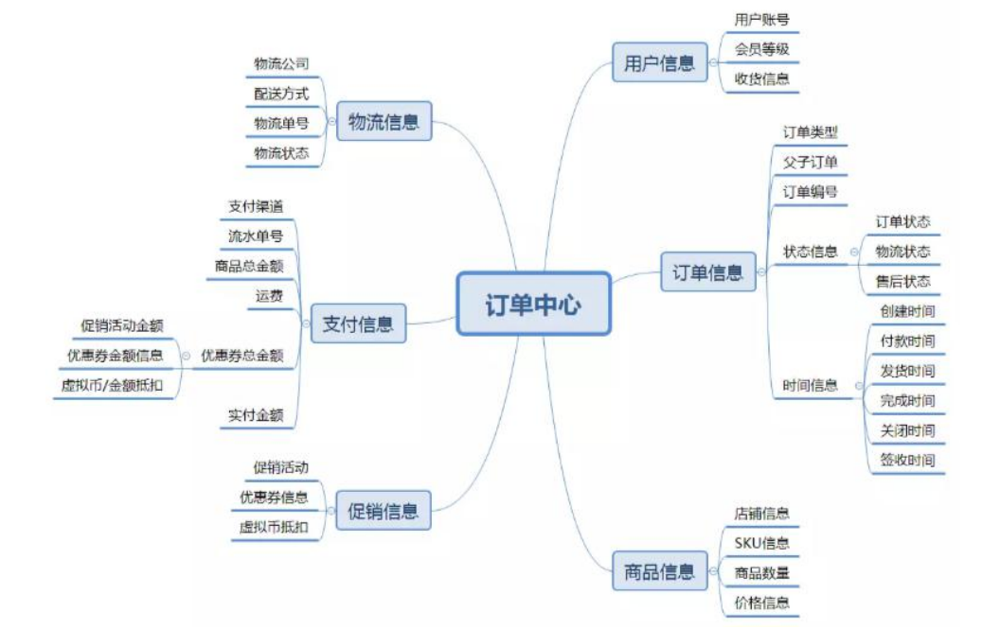
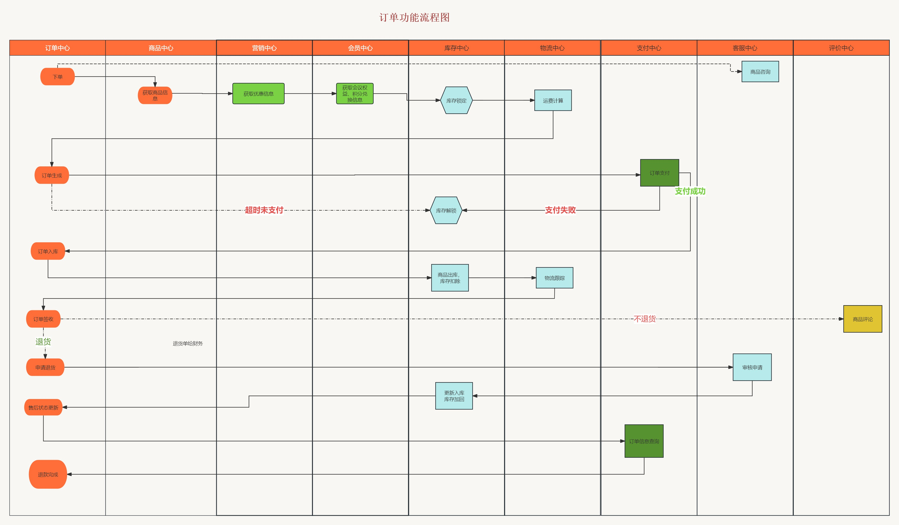

 一、订单业务构成
1、设计简图：

2、订单状态说明：
(1). 待付款
   用户提交订单后，订单进行预下单，目前主流电商网站都会唤起支付，便于用户快速完成支
   付，需要注意的是待付款状态下可以对库存进行锁定，锁定库存需要配置支付超时时间，超
   时后将自动取消订单，订单变更关闭状态。
(2). 已付款/待发货
   用户完成订单支付，订单系统需要记录支付时间，支付流水单号便于对账，订单下放到库存系统，
   仓库进行调拨，配货，分拣，出库等操作。
(3). 待收货/已发货
   仓储将商品出库后，订单进入物流环节，订单系统需要同步物流信息，便于用户实时知悉物
   品物流状态
(4). 已完成
   用户确认收货后，订单交易完成。后续支付侧进行结算，如果订单存在问题进入售后状态
(5). 已取消
   付款之前取消订单。包括超时未付款或用户商户取消订单都会产生这种订单状态。
(6). 售后中
   用户在付款后申请退款，或商家发货后用户申请退换货。售后也同样存在各种状态，当发起售后申请后生成售后订单，售后订单状态为待审核，等待
   商家审核，商家审核通过后订单状态变更为待退货，等待用户将商品寄回，商家收货后订单
   状态更新为待退款状态，退款到用户原账户后订单状态更新为售后成功。

2、订单流程：
 大致流程：订单生成–>支付订单–>卖家发货–>确认收货–>交易成功。其中涉及到诸多系统的交互。
订单功能流程图：
流程说明：
1、订单创建与支付
(1) 订单创建前需要预览订单，选择收货信息等
(2) 订单创建需要锁定库存，库存有才可创建，否则不能创建
(3) 订单创建后超时未支付需要解锁库存
(4) 支付成功后，需要进行拆单，根据商品打包方式，所在仓库，物流等进行拆单
(5) 支付的每笔流水都需要记录，以待查账
(6) 订单创建，支付成功等状态都需要给 MQ 发送消息，方便其他系统感知订阅
2、逆向流程
(1) 修改订单，用户没有提交订单，可以对订单一些信息进行修改，比如配送信息，优惠信息，及其他一些订单可修改范围的内容，此时只需对数据进行变更即可。
(2) 订单取消，用户主动取消订单和用户超时未支付，两种情况下订单都会取消订单，而超时情况是系统自动关闭订单，所以在订单支付的响应机制上面要做支付的
限时处理，尤其是在前面说的下单减库存的情形下面，可以保证快速的释放库存。另外需要需要处理的是促销优惠中使用的优惠券，权益等视平台规则，进行相应补回给用户。
(3) 退款，在待发货订单状态下取消订单时，分为缺货退款和用户申请退款。如果是全部退款则订单更新为关闭状态，若只是做部分退款则订单仍需进行进行，同时生
成一条退款的售后订单，走退款流程。退款金额需原路返回用户的账户。
(4) 发货后的退款，发生在仓储货物配送，在配送过程中商品遗失，用户拒收，用户收货后对商品不满意，这样情况下用户发起退款的售后诉求后，需要商户进行退款
的审核，双方达成一致后，系统更新退款状态，对订单进行退款操作，金额原路返回用户的账户，同时关闭原订单数据。仅退款情况下暂不考虑仓库系统变化。如果
发生双方协调不一致情况下，可以申请平台客服介入。在退款订单商户不处理的情况下，系统需要做限期判断，比如 5 天商户不处理，退款单自动变更同意退款。

3、实现要点
(1)、幂等性处理，防止接口重复提交
(2)、防止超卖
(3)、自动关单
